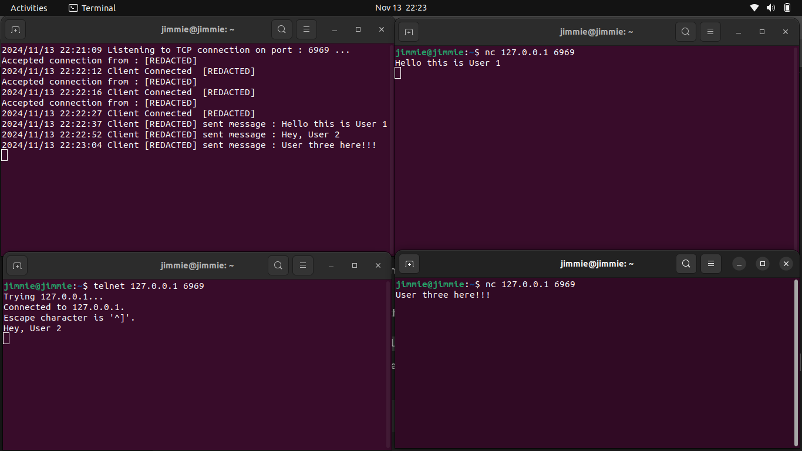

# TCP Server Documentation

## Overview

This TCP server application handles multiple client connections, allowing
clients to send messages to each other with certain constraints on message rate
and strikes. Clients who exceed the strike limit or exhibit other restricted
behavior can be temporarily banned.

## Features

- **Message Broadcasting**: Messages sent by a client are broadcast to other
  connected clients.
- **Rate Limiting**: Enforces a rate limit on messages per client.
- **Strike and Ban System**: Clients are banned if they exceed a configurable
  number of strikes.
- **Safe Mode**: Sensitive information (e.g., IP addresses) can be redacted for
  privacy.

## Constants

| Constant      | Type      | Description                                                                  |
| ------------- | --------- | ---------------------------------------------------------------------------- |
| `MessageRate` | `float64` | Time in seconds clients must wait between sending messages.                  |
| `PORT`        | `string`  | Port on which the server listens for incoming connections (default: `6969`). |
| `SAFE_MODE`   | `bool`    | Redacts sensitive information if set to `true`.                              |
| `BanLimit`    | `float64` | Time in seconds clients are banned for if they exceed the strike limit.      |
| `StrikeLimit` | `int`     | Number of strikes allowed before a client is banned.                         |

## Data Structures

### `Client`

Represents a connected client and tracks:

- `Conn`: Network connection to the client.
- `LastMessage`: Timestamp of the last message sent by the client.
- `StrikeCount`: Number of strikes accumulated by the client.

### `MessageType`

Defines types of events in the server:

- `ClientConnected`: A client has connected to the server.
- `NewMessage`: A new message is received from a client.
- `ClientDisconnected`: A client has disconnected from the server.

### `Message`

Represents a message or event, containing:

- `Type`: Type of the message (e.g., `ClientConnected`, `NewMessage`).
- `Conn`: Connection associated with the message.
- `Text`: Content of the message (for `NewMessage` type).

## Functions

### `sensitive(message string) string`

Redacts the input `message` if `SAFE_MODE` is enabled, otherwise returns the
original message.

### `server(messages chan Message)`

Main server logic that handles different types of messages from clients:

- **Client Connected**: Logs connection, adds client to the client list unless
  banned.
- **New Message**: Checks rate limits, broadcasts message to other clients, or
  increases strikes if rate exceeded.
- **Client Disconnected**: Logs disconnection and removes client from the client
  list.

### `client(conn net.Conn, messages chan Message)`

Handles communication for a single client:

- Reads incoming data from the client and sends it to the server through the
  `messages` channel.
- On reading error, signals `ClientDisconnected`.

### `main()`

Entry point for the server:

- Sets up a TCP listener on the specified `PORT`.
- Accepts new client connections and spawns a `client` handler for each
  connection.
- Initiates the server's main event loop by starting `server(messages)` as a
  goroutine.

## Usage

1. **Run the Server**: Start the server using `go run main.go`.
2. **Client Connections**: Clients can connect to the server on the specified
   port (default: `6969`).
3. **Message Broadcasting**: Once connected, clients can send messages that will
   be broadcast to other clients.
4. **Rate Limiting and Ban Mechanism**: Clients should limit message rate to
   avoid strikes and bans.

## Error Handling

- **Connection Failures**: Errors during connection or message broadcast are
  logged, and connections are removed as necessary.
- **Ban Handling**: Temporarily bans clients who exceed strike limits, based on
  the configurable `BanLimit`.

## Example Output

- **Client Connected**: `Client Connected [REDACTED]`
- **New Message**: `Client [REDACTED] sent message: Hello World`
- **Client Disconnected**: `Client Disconnected [REDACTED]`

## Configuration

The constants `MessageRate`, `PORT`, `SAFE_MODE`, `BanLimit`, and `StrikeLimit`
can be modified to customize the server's behavior.

---

This application provides a robust setup for managing TCP client connections
with basic security, rate limiting, and broadcast functionality.
